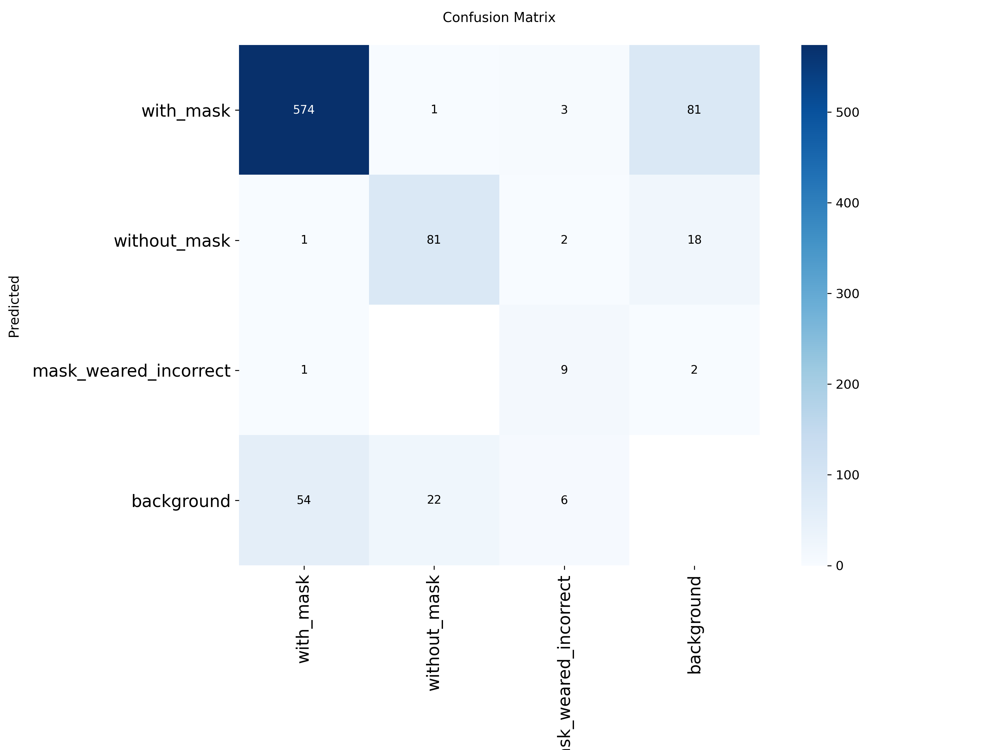
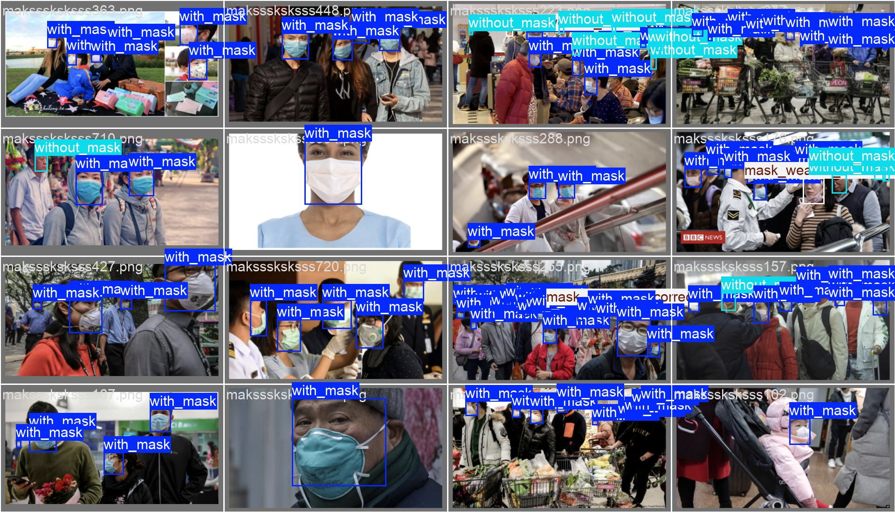
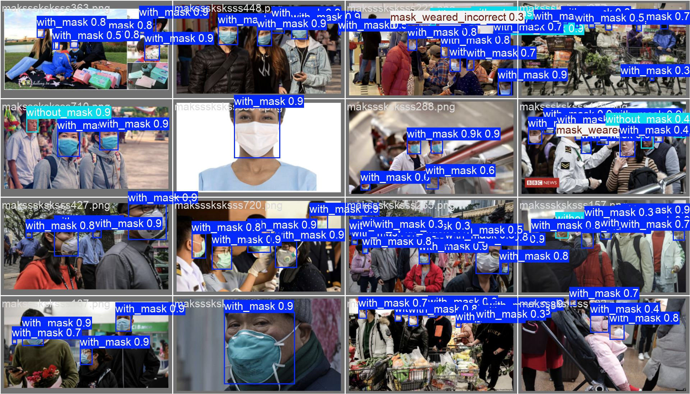

# 😷 Real-Time Face Mask Detection using YOLOv8

An end-to-end computer vision project for **real-time face mask compliance detection** using the **YOLOv8 object detection framework**.
The system accurately detects faces and classifies them into three categories based on mask usage.

---

## 🎯 Project Objective

The objective of this project is to automate **safety monitoring in public places** such as hospitals, airports, offices, and schools by detecting whether individuals are:

* Wearing a face mask correctly
* Not wearing a face mask
* Wearing a face mask incorrectly (not covering nose or mouth)

The model is optimized for **real-time performance** and **high detection accuracy**.

---

## 🧠 Classes Detected

The YOLOv8 model is trained on **three classes**:

| Class ID | Class Name            |
| -------- | --------------------- |
| 0        | With Mask             |
| 1        | Without Mask          |
| 2        | Mask Worn Incorrectly |

---

## 🛠️ Tech Stack

* **Model Architecture**: YOLOv8 (Ultralytics)
* **Deep Learning Framework**: PyTorch
* **Computer Vision**: OpenCV
* **Data Handling**: NumPy, Pandas
* **Annotation Format**: YOLO (Normalized Center-Based)
* **Training Environment**: Python (Anaconda / venv)

---

## 📊 Evaluation & Results

### 🔹 Confusion Matrix

The confusion matrix illustrates the classification performance of the model on the validation dataset.
High values along the diagonal indicate strong true-positive detection for each class.





---

### 🔹 Model Predictions vs Ground Truth

Below is a comparison between **human-annotated labels** and **model predictions**, showing accurate localization and classification even in complex scenes.

|         Ground Truth (Labels)         |             Model Predictions            |
| :-----------------------------------: | :--------------------------------------: |
|  |  |

---

## 📁 Dataset Preparation

* Original annotations were in **PASCAL VOC (XML)** format
* A **custom XML-to-YOLO conversion script** was written
* Bounding boxes were converted to:

  ```
  class_id, x_center, y_center, width, height
  ```
* All values were normalized between **0 and 1**

---

## 🚀 Getting Started

### 1️⃣ Clone the Repository

```bash
git clone https://github.com/AlsoMeParth/Face-Mask-Detection-yolov8.git
cd face-mask-detection-yolov8
```

---

### 2️⃣ Install Dependencies

```bash
pip install -r requirements.txt
```

---

### 3️⃣ Train the YOLOv8 Model

```python
from ultralytics import YOLO

model = YOLO("yolov8n.pt")
model.train(
    data="data.yaml",
    epochs=50,
    imgsz=640
    # freeze=10 # Optional: Freeze first 10 layers
)
```
### 🧠 Explanation of Training Parameters

* **`YOLO("yolov8n.pt")`**
  Loads the YOLOv8 Nano model pre-trained on the COCO dataset. The Nano version is lightweight and suitable for systems with limited computational resources while still maintaining good detection accuracy.

* **`data="data.yaml"`**
  Specifies the dataset configuration file. This file defines:

  * Paths to training and validation images
  * Number of object classes
  * Class names (e.g., With Mask, Without Mask, Mask Worn Incorrectly)

* **`epochs=50`**
  Determines how many complete passes the model makes over the training dataset. More epochs allow better learning but may increase the risk of overfitting.

* **`imgsz=640`**
  Sets the input image resolution for training. A resolution of 640×640 is a balanced choice between detection accuracy and training speed.

* **`freeze=10` (optional)**
  Freezes the first 10 layers of the neural network so that their weights are not updated during training.

---

### 📝 Technical Note: Layer Freezing & Fine-Tuning

By default, **YOLOv8 unfreezes all layers when training begins**. This enables **full fine-tuning**, meaning:

* All layers of the network are trainable
* The model fully adapts to the custom dataset
* Feature representations are optimized for face mask detection

This approach is particularly effective when the dataset is reasonably sized and sufficiently diverse.

#### 🔹 Layer Freezing

Layer freezing prevents early layers from updating their weights during training. These layers usually capture basic features such as edges, corners, and textures.

Layer freezing is recommended when:

* The dataset is small
* Faster training is required
* Overfitting needs to be minimized
Training outputs (weights, metrics, plots) are saved in:

```
runs/detect/train/
```

---

### 4️⃣ Live Webcam Inference

To run real-time face mask detection using your webcam:

```bash
python scripts/detect_live.py
```

---

## 📈 Training Logs & Metrics

* YOLOv8 logs training metrics to:

  * `results.csv`
  * `results.png`
  * Precision–Recall & F1 curves
* TensorBoard is **not enabled by default** in Ultralytics YOLO
* Metrics visualization is handled internally by YOLO

---

## 📂 Repository Structure

```
face-mask-detection-yolov8/
│
├── models/
│   └── best.pt
│
├── scripts/
│   ├── xml_to_yolo.py
│   └── detect_live.py
│
├── docs/
│   ├── confusion_matrix.png
│   ├── val_batch0_labels.jpg
│   └── val_batch0_pred.jpg
│
├── runs/
│   └── detect/train/
│
├── data.yaml
├── requirements.txt
└── README.md
```

---


## 📜 Conclusion

This project demonstrates the effectiveness of **YOLOv8 for real-time face mask detection**, making it suitable for practical deployment in real-world safety and surveillance applications.

---


